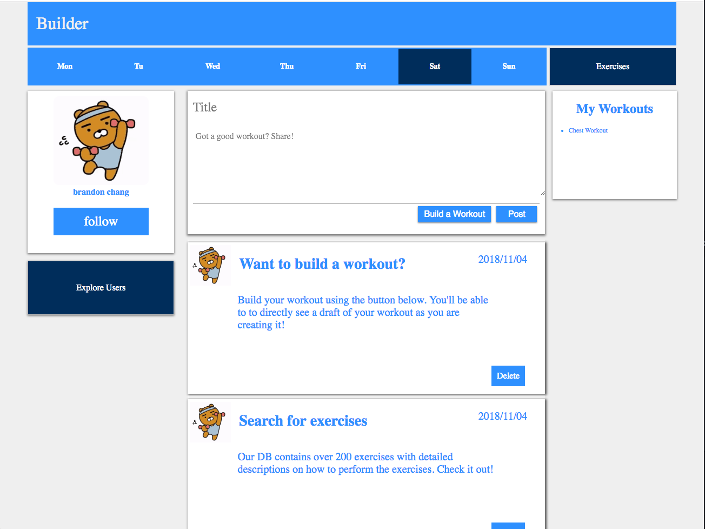

# builder
A lightweight app that enables users to create their workouts in real time. Keep track and manage the amount of weight and 
reps you complete per exercise. The application even includes over 200 exercises to search from with detailed descriptions!
# Technology
HTML/CSS/Javascript/Jquery/Express/NodeJs
# Screenshots
 
# Live Repo
https://buildr-workout.herokuapp.com/login
# Features
Create your exercises and store them
Search for through over 200 exercises stored in the DB
Share posts and follow other users
